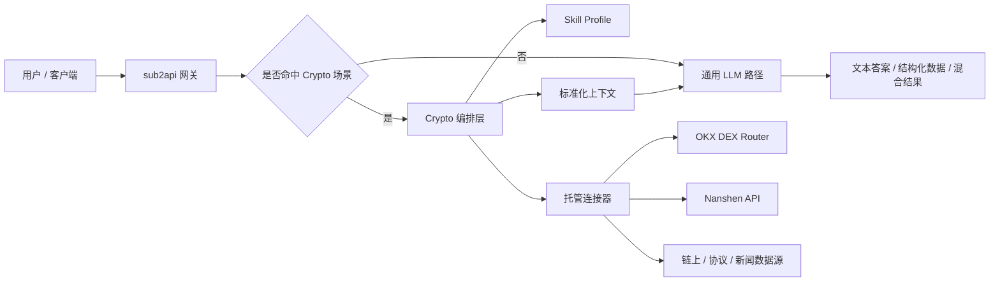
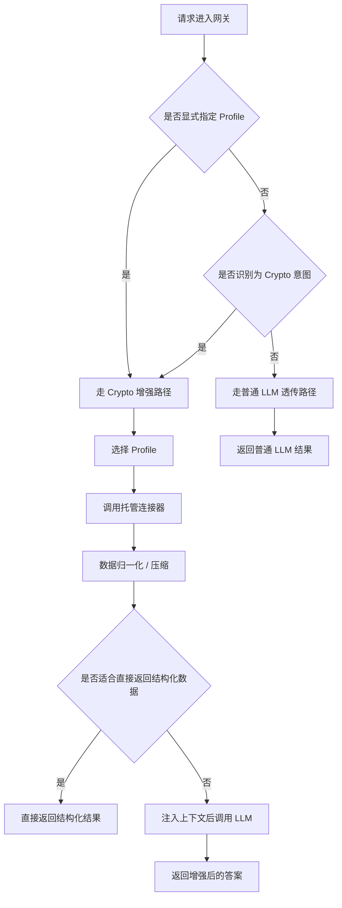
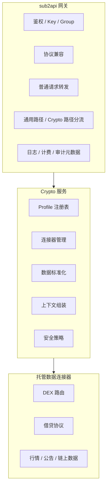
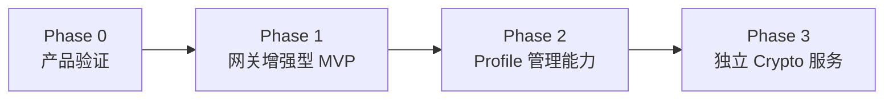
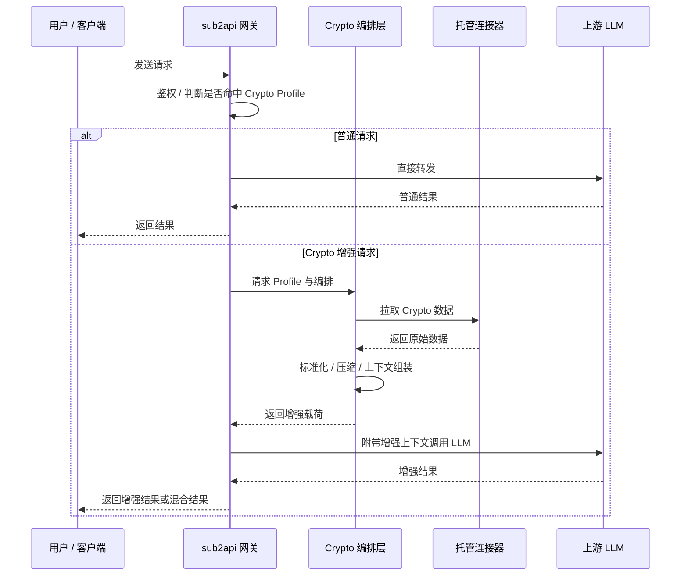
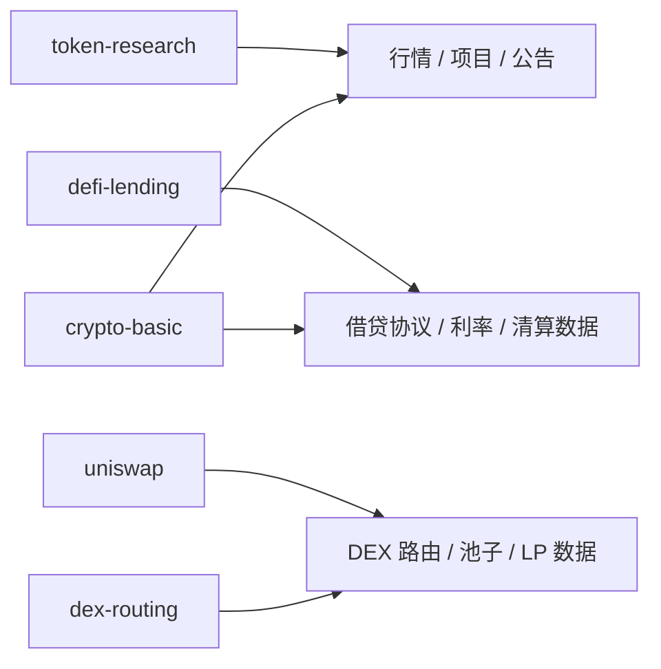
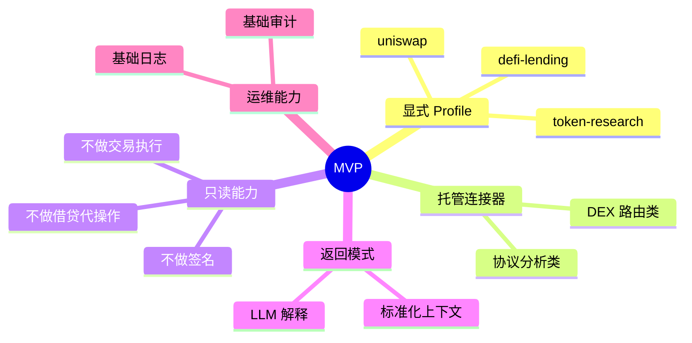

# 任务

## 标题
Crypto 智能网关与服务端托管 Skill Profile

## 分类
- 产品行为变更
- 网关 / 协议兼容性变更
- Prompt 资产 / 服务端 Skill 编排
- 纯文档规划

## 一页总览

### 产品形态图

### 请求分流图

### 组件职责图

### 分阶段路线图

## 背景

`sub2api` 当前已经不是一个单纯的转发代理，而是一个 AI Gateway 平台。它已经具备协议兼容转发、上游账号路由、网关适配和产品化兼容行为等能力。

下一步的产品方向，是在现有网关基础上增加面向 Crypto 场景的智能能力：

- 用户仍然可以像现在一样，把它当作普通 LLM 网关来使用
- 用户也可以直接发起 Crypto 相关问题，而不需要自己安装复杂 skill、维护多套第三方数据 API key
- 平台可以在服务端托管 Crypto 数据连接器与 Skill Profile，在部分请求进入 LLM 之前，先做数据获取、清洗、归一化和上下文增强

这个方向应该保持 `sub2api` 作为网关的定位，同时避免过早把系统改造成一个通用型、全功能的 Agent Runtime。

## 问题定义

Crypto 用户通常会遇到三类重复性摩擦：

1. 数据接入摩擦：很多有价值的 Crypto 数据源需要单独申请 API key、完成审批并自行接入
2. Skill 使用摩擦：像 Uniswap、DeFi Lending、Token Research 这类场景，往往需要安装、配置和调优专门的 skill、prompt 和工具链
3. 数据到答案的摩擦：原始 API 返回通常噪声较大、格式不统一，终端用户无法直接消费，仍然需要额外的归一化和总结

因此，很多本来可以从 Crypto 智能助手中获益的用户，要么根本搭不起来完整工具栈，要么每个人都在重复做同样的数据接入和 prompt 工程工作。

## 产品目标

构建一个 Crypto 增强型网关产品，使其能够：

- 保持 `sub2api` 对普通 LLM 请求的网关能力
- 对 Crypto 相关请求进行识别，或者通过显式 profile 触发增强路径
- 在需要时访问服务端托管的 Crypto 数据源，并进行归一化处理
- 在选定请求中注入服务端托管的 Crypto Skill 上下文
- 向用户返回结构化数据、LLM 生成答案，或二者的组合

## 产品定位

这个产品不是一个纯转发代理。

这个产品在第一阶段也不是一个通用的 Agent Runtime，不追求支持任意服务端工具执行、长期记忆、复杂自治工作流或广义编排系统。

更准确的定位是：

- 一个协议兼容的 AI Gateway
- 加上一层服务端托管的 Crypto 数据访问能力
- 加上一层服务端托管的 Crypto Skill Profile
- 再加上一套针对 Crypto 场景的选择性请求增强机制

## 用户

### 主要用户
- Crypto 交易用户
- DeFi 使用者
- Token / 项目研究用户
- 希望开箱即用使用 Crypto 智能助手、但不愿意自己管理多套工具和 API key 的用户

### 次要用户
- 负责管理上游 LLM 账号、数据连接器、配额和 Skill Profile 的运营方
- 希望通过一个统一 API 同时获得普通 LLM 能力和 Crypto 增强能力的客户端应用

## 核心使用场景

1. 普通 AI 透传
- 用户发送普通问题
- 网关不做 Crypto 增强，直接走现有 LLM 转发路径

2. 带服务端增强的 Crypto 问题
- 用户询问 Token、协议、DEX、借贷、钱包风险等问题
- 网关识别请求为 Crypto 场景，或收到显式指定的 Crypto Profile
- 网关调用服务端托管的数据源获取相关信息
- 网关注入结构化上下文和对应 Skill 指导
- LLM 基于增强后的上下文生成答案

3. 预置领域 Profile 使用
- 用户选择 `uniswap`、`defi-lending`、`token-research` 等 profile
- 网关自动加载匹配的服务端 Skill 配置，而不要求用户在客户端自行安装 skill

4. 托管连接器使用
- 网关调用平台托管的 OKX DEX Router、Nanshen API、链上数据源等
- 用户不需要自行申请和维护这些数据源的 API key

5. 结构化数据直出
- 某些场景更适合直接返回结构化数据，而不是自然语言总结
- 网关可以返回标准化数据，也可以将标准化数据与 LLM 解释组合输出

## 非目标

第一阶段不追求：

- 演进为一个通用自治 Agent 平台
- 在服务端静默代用户执行高风险金融动作
- 对所有客户端声明的工具一律做服务端代执行
- 为了验证这个产品方向而先引入全新的平台抽象
- 一开始就重构所有现有网关兼容路径

## 产品原则

1. 普通请求默认仍应保持简洁透传
2. Crypto 增强应尽量显式、可审计、范围可控
3. 服务端托管连接器应优先覆盖只读和分析型场景
4. 交易、签名、转账、借贷执行、授权修改等高风险动作，不应在服务端静默执行
5. Provider 传输层特性应留在 gateway / provider 所属代码路径中，而不是散落到无关业务逻辑中
6. Skill 注入优先采用配置驱动
7. 平台的核心优势应来自托管数据、标准化处理和领域工作流，而不是单纯依赖隐藏式 prompt 改写

## 建议的产品形态

### 1. 混合路由模型

每个请求进入系统后，走两条主路径之一：

- 通用路径：沿用当前网关能力，直接转发给 LLM
- Crypto 增强路径：先调用连接器和 Skill Profile 做增强，再转发给 LLM 或直接返回结构化结果

### 2. 服务端托管的 Crypto Skill Profile

平台对外暴露的是 Profile，而不是要求用户自己安装和配置零散 skill。

示例：

- `crypto-basic`
- `token-research`
- `uniswap`
- `defi-lending`
- `dex-routing`
- `wallet-risk`

每个 Profile 可以定义：

- 路由提示
- 所需连接器
- 允许的服务端工具
- Prompt / Context 资产
- 数据归一化规则
- 响应格式偏好
- 安全策略

### 3. 服务端托管的连接器层

平台统一托管对第三方 Crypto 信息服务的接入。

示例：

- OKX DEX Router
- Nanshen API
- 链上索引服务
- 协议分析服务
- 行情 / 新闻 / 公告数据源

连接器层负责：

- 保管由运营方配置的凭证
- 构造上游请求
- 将上游返回归一化为内部结构
- 缓存热点数据
- 做错误分类和降级
- 处理 Provider 级别的限流与调用控制

### 4. LLM 前置增强

对于 Crypto 增强请求，网关可以：

- 识别请求意图
- 选择合适的 Skill Profile
- 获取所需数据
- 对数据进行压缩和标准化
- 附加结构化上下文块
- 注入有限边界的 Profile 指令
- 再调用下游 LLM

### 5. 结构化结果直出模式

对于某些更偏查询、路由、数据获取的请求，平台可以：

- 直接返回标准化数据
- 或先返回标准化数据，再附带 LLM 解释
- 或在安全性更高的情况下，优先输出事实型结果而不是自由生成文本

## 功能需求

### FR1. 请求模式选择

平台至少应支持以下一种或多种选择方式：

- 显式请求头或参数
- 显式 model alias 或 profile 字段
- 轻量级服务端意图识别

建议第一阶段优先显式选择，其次再补充意图推断作为兜底。

### FR2. 通用透传能力保持

未命中 Crypto 路径的请求，应尽可能保持当前网关语义不变。

### FR3. Crypto Profile 注册表

平台需要有一个服务端托管的 Crypto Profile 注册表，至少包含：

- profile id
- 描述
- 启用状态
- 所依赖的连接器
- 上下文拼装规则
- 安全约束

### FR4. 连接器抽象

平台需要具备面向托管 Crypto 数据源的连接器抽象，支持：

- 鉴权与凭证存储
- 请求构造
- 响应归一化
- 错误分类
- 缓存能力
- 限流感知

### FR5. 上下文拼装

平台需要能够将以下信息组合为受控增强载荷：

- 用户原始问题
- 选定 Profile 的指令内容
- 连接器返回的标准化数据
- 可选的来源元数据 / 引用信息

并将其作为有边界的上下文发送给下游 LLM。

### FR6. 工具执行策略

平台需要区分三类工具：

- `server_owned`：安全、只读、由平台托管执行的工具
- `client_owned`：应继续暴露给客户端、由客户端执行的工具
- `blocked`：不允许或高风险的工具

第一阶段应优先支持只读型的 `server_owned` Crypto 工具。

### FR7. 响应整形

平台需要支持：

- 普通 LLM 文本响应
- 结构化数据响应
- 结构化数据与生成式解释的混合响应

### FR8. 运营配置能力

运营方需要能够：

- 启用或关闭 Profile
- 配置连接器凭证
- 按 group 或 key 分配可用 Profile
- 观察连接器失败和请求路由情况

### FR9. 可审计性

平台应记录足够多的元数据，以便回答：

- 某次请求是否走了 Crypto 增强路径
- 应用了哪个 Profile
- 查询了哪些连接器
- 响应中是否包含服务端托管数据

### FR10. 安全策略

平台必须具备防止高风险金融动作被静默服务端执行的策略能力。

## 架构建议

### 推荐的近期形态

保持 `sub2api` 作为：

- 统一入口网关
- 协议兼容层
- 鉴权、key、group、计费和路由层
- 通用路径与 Crypto 增强路径的分流入口

另外引入独立的 Crypto 服务，用来承载：

- 托管连接器执行
- Profile 注册表
- 上下文组装
- Crypto 领域归一化逻辑
- 领域安全策略

### 这样拆分的原因

这样做可以保留 `sub2api` 作为网关的核心职责，同时让 Crypto 领域逻辑独立演进，避免随着连接器和 Profile 增多，把大量领域编排逻辑压进现有网关内部。

### 备选方案

如果目标是快速验证 MVP，也可以在第一阶段将少量 Crypto 增强逻辑先放在现有 service 层中，前提是：

- 连接器数量较少
- Profile 范围较窄
- 目标是快速验证，而不是一次性达成最终架构

但即使采用这种方式，也应保持边界清晰，不要把 Provider 传输特性和 Crypto 领域逻辑散落到无关路径中。

## 请求流程

### 识别原理简述

服务端不是直接读取用户的 Prompt 后就立刻调用某个连接器。

更合理的做法是，先把自然语言问题转换成一个可执行的数据查询任务，再去取数和生成结果。

简化后可以理解为 4 步：

1. 识别意图：先判断用户是在查价格、查路由、做借贷分析，还是做项目研究
2. 提取参数：从问题里提取链、Token、数量、协议名、时间范围等结构化信息
3. 映射任务：根据意图和参数，决定应该调用哪个连接器，而不是让模型自由决定
4. 组织结果：将连接器返回的数据归一化，再选择直接返回结构化结果，或交给 LLM 做解释

这套机制的核心，是把“自然语言”转换成“任务类型 + 查询参数 + 执行计划”。

例如：

- 用户输入：`帮我分析一下现在把 10 ETH 在以太坊上换成 USDC，哪个路由更优，风险点是什么`
- 服务端识别：这是一个 `dex-routing` 场景
- 服务端提取参数：`chain=ethereum`、`from_token=ETH`、`to_token=USDC`、`amount=10`
- 服务端映射连接器：调用 DEX Router 类连接器
- 服务端归一化结果：得到候选路径、滑点、gas、价格影响等标准化数据
- 服务端输出：一部分保留结构化结果，一部分交给 LLM 解释“哪个更优、为什么、风险点是什么”

### 流程序列图

### 通用路径

1. 客户端发送请求
2. 网关完成鉴权与路由
3. 请求直接转发到目标 LLM 路径
4. 使用现有兼容逻辑将结果返回给客户端

### Crypto 增强路径

1. 客户端发送带有显式 Profile 或明显 Crypto 意图的请求
2. 网关完成鉴权并解析 Profile / 路由策略
3. 网关调用独立 Crypto 服务，或内部的 Crypto 编排路径
4. Crypto 编排层访问托管连接器获取数据
5. 数据被归一化为内部结构
6. 按 Profile 规则拼装上下文
7. 网关将增强后的请求发送给下游 LLM，或者直接返回结构化数据
8. 响应返回给客户端，同时保留可用于运维与审计的路由元数据

## 数据与 Skill 模型

### Profile 与连接器关系图

### 建议的首批 Profile

- `crypto-basic`：基础 Crypto 语义与分析框架
- `token-research`：Token / 项目概览、风险框架与基础研究
- `uniswap`：池子、LP、路由、费率档位等分析
- `defi-lending`：借贷利率、抵押率、借款风险、清算框架
- `dex-routing`：路径查询与执行路径比较

### 连接器类别

- 行情 / 定价
- DEX 路由
- 借贷协议状态
- 链上活动 / 钱包状态
- 协议公告 / 新闻

### Skill 组合模型

每个 Profile 可以组合：

- Profile 指令资产
- 必需连接器列表
- 响应结构提示
- 安全标记

## 安全与合规要求

1. 第一阶段仅优先支持只读数据访问
2. 高风险金融动作默认不纳入范围
3. 第三方连接器的使用条款和转售 / 再分发规则，需要逐个确认
4. 运营方配置的凭证必须始终保留在服务端
5. 敏感上游密钥不得暴露给终端用户

## UX / API 设计选项

可能的用户侧触发方式包括：

- 请求头，例如 `X-Agent-Profile: uniswap`
- 请求体字段，例如 `profile: "defi-lending"`
- model alias，例如 `crypto/uniswap`
- 按 API key group 强制分配 Profile

建议第一阶段采用：

- 显式 Profile 选择
- 可选的轻量意图识别作为补充

## 验收标准

AC1：产品能够对非 Crypto 请求继续保留普通 LLM 网关透传能力

AC2：产品能够应用至少一个显式 Crypto Profile，且不要求客户端安装 skill

AC3：产品能够调用至少一个服务端托管连接器，并将返回结果归一化

AC4：产品能够在向上游 LLM 转发前，为请求注入标准化的 Crypto 上下文

AC5：产品能够区分服务端只读 Crypto 工具、客户端工具和被阻断工具

AC6：产品能够向运营侧暴露请求是否命中 Crypto 增强路径的元数据

AC7：第一阶段不会在服务端静默执行高风险金融动作

## MVP 建议

### MVP 范围图

### MVP 范围

- 只支持显式 Profile 选择
- 支持 2 到 3 个服务端托管 Profile
- 支持 1 到 2 个托管连接器
- 仅支持只读数据访问
- 至少打通一条 OpenAI 兼容路径上的增强调用链
- 提供 Profile 和连接器的基础日志与可观测性

### 建议的首批 Profile

- `token-research`
- `uniswap`
- `defi-lending`

### 建议的首批连接器

- 一个 DEX 路由类数据源
- 一个协议分析或聚合分析类数据源

### 建议的首批输出模式

- 标准化上下文 + LLM 解释

## 分阶段推进建议

### Phase 0：产品验证

- 确认首批 Profile 列表
- 确认可接入的连接器范围
- 核对各第三方数据源是否允许服务端托管、多租户使用和结果再提供

### Phase 1：网关增强型 MVP

- 增加显式 Profile 选择能力
- 增加最小连接器抽象
- 增加 Crypto 增强调用链
- 增加日志与基础可观测性

### Phase 2：Profile 管理能力

- 增加 Profile 注册表 / 配置能力
- 增加基于 group / key 的策略
- 增加更完善的审计和使用统计

### Phase 3：独立 Crypto 服务

- 将不断增长的领域逻辑迁移到独立服务
- 扩大 Profile 和连接器生态
- 支持更丰富的结构化响应模式

## 风险

1. 在产品需求尚未验证前，就过早膨胀为一个完整 Agent Runtime
2. 服务端吞掉过多工具调用，破坏现有网关兼容语义
3. 第三方连接器存在使用条款、转售或再分发限制
4. 增强路径引入额外延迟
5. 数据时效性与缓存失效策略复杂
6. 如果标准化数据与生成式回答没有清晰边界，容易放大幻觉风险

## 待确认问题

1. 上线初期，Crypto 触发方式是否只允许 Profile 显式选择，还是也允许自动意图识别？
2. 哪些连接器在法律、商业条款和多租户模式下是安全可用的？
3. 第一版产品更应强调原始结构化数据、生成式分析，还是二者结合？
4. 哪些 Profile 边界最容易被用户理解，也最适合后续定价？
5. 增强响应是否默认向客户端暴露来源元数据？

## 后续实现规划的验证方式

进入实现阶段后，应将每个验收标准映射到：

- 归属层
- 需要修改的文件集合
- 对应测试或 smoke path
- 需要同步更新的文档

后续可能的验证项包括：

- Profile 路由相关的网关单测
- 连接器 mock / 集成测试
- 增强请求组装测试
- streaming 与非 streaming 兼容测试
- 仓库级校验：`bash scripts/validate.sh`
