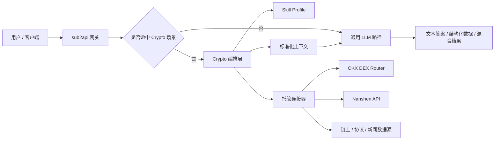
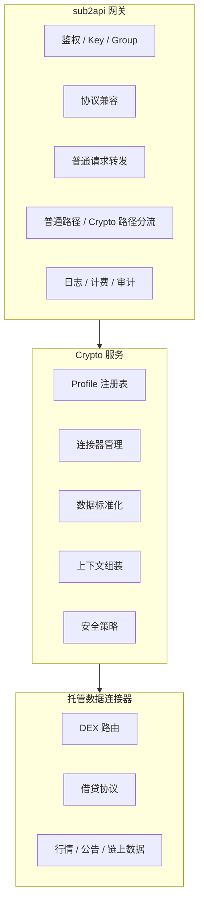
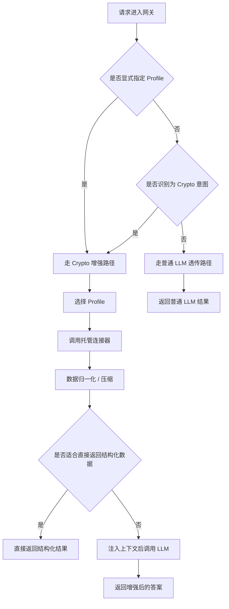
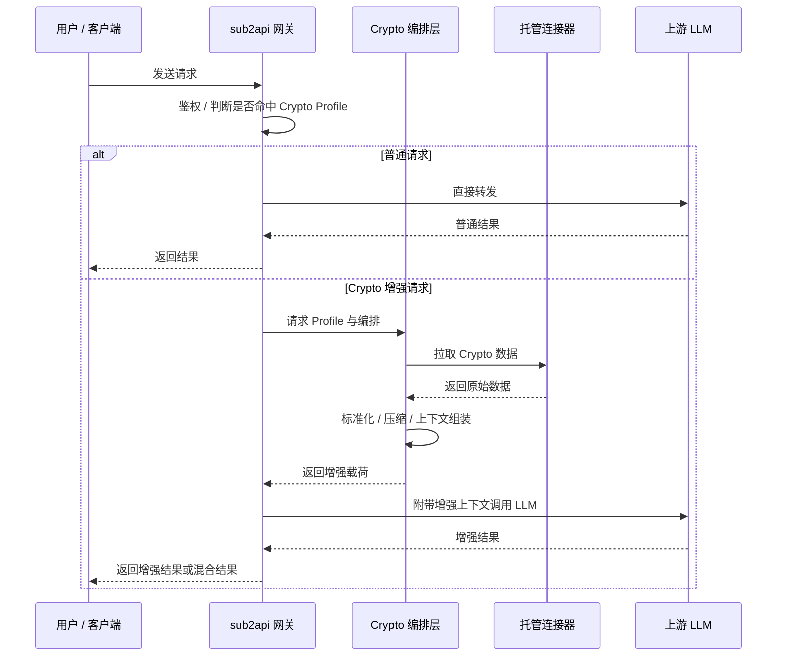
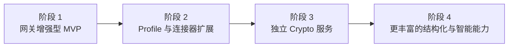

# Crypto 智能网关需求文档

## 1. 目标与愿景

### 1.1 我们要做什么

我们希望在现有 `sub2api` 网关能力之上，增加一层面向 Crypto 场景的智能增强能力。

这个产品既不是一个单纯的 LLM 转发代理，也不是一开始就要做成一个通用 Agent Runtime。

更准确地说，它是一个：

- 保留通用 LLM 网关能力的入口
- 托管 Crypto 专用数据能力的增强层
- 托管 Crypto 专用 Skill / Profile 的服务端能力层

### 1.2 为什么要做

Crypto 用户在使用 AI 时，通常会遇到三个问题：

- 数据接入麻烦：很多有价值的数据源需要单独申请 API key、审批、接入和维护
- Skill 安装麻烦：像 `uniswap`、`defi-lending`、`token-research` 这类 skill，用户自己配置成本很高
- 原始数据不适合直接消费：用户即使拿到了数据，也很难直接变成可读、可解释、可决策的信息

因此，这个产品的价值，不是“再提供一个模型入口”，而是：

- 帮用户屏蔽复杂的数据接入过程
- 帮用户屏蔽 skill 安装和调优过程
- 把数据能力、领域能力和 LLM 能力组合成可直接使用的输出

### 1.3 愿景

中长期愿景是把它做成一个面向 Crypto 场景的智能网关：

- 普通问题，仍然像普通 LLM 网关一样工作
- Crypto 问题，自动挂载服务端托管的数据能力和领域能力
- 用户不需要自己管理一堆第三方 API key 和 skill
- 平台真正的护城河来自托管数据、标准化处理和领域工作流

### 1.4 产品边界

第一阶段不追求：

- 做成通用自治 Agent 平台
- 在服务端代用户静默执行高风险动作
- 把所有客户端 tool call 都吞到服务端执行

第一阶段优先做的是：

- 只读型数据能力
- Profile 驱动的增强能力
- 数据归一化 + LLM 解释

## 一页图示

### 产品整体形态

### 组件职责

## 2. 基础架构与处理逻辑

### 2.1 基础架构

推荐的基础架构分为两层：

#### A. `sub2api` 网关层

负责：

- 用户请求入口
- 协议兼容
- API key / group / 路由 / 计费
- 普通请求与 Crypto 请求分流

#### B. Crypto 增强层

负责：

- 服务端托管的 Skill Profile
- 服务端托管的连接器
- 数据标准化
- 上下文增强
- 领域安全策略

也就是说：

- `sub2api` 继续承担“网关”的职责
- Crypto 相关的领域逻辑尽量收敛在独立的增强层中

### 2.2 请求处理总逻辑

请求进入系统后，会先判断是否需要走 Crypto 增强链路。

### 2.3 识别原理

服务端不是直接读取用户 Prompt 后就去调某个接口。

真正的逻辑是先把自然语言问题，转换成一个可执行的数据查询任务。

可以简化理解为 4 步：

1. 识别意图
2. 提取参数
3. 映射连接器
4. 组织结果

也就是把：

- “自然语言问题”

转换成：

- “任务类型 + 查询参数 + 执行计划”

### 2.4 一个具体例子

用户输入：

`帮我分析一下现在把 10 ETH 在以太坊上换成 USDC，哪个路由更优，风险点是什么`

服务端内部处理逻辑：

1. 识别意图：这是一个 `dex-routing` 场景
2. 提取参数：`chain=ethereum`、`from_token=ETH`、`to_token=USDC`、`amount=10`
3. 映射连接器：调用 DEX Router 类连接器
4. 获取数据：拿到候选路径、滑点、gas、价格影响等信息
5. 归一化结果：将不同数据源返回统一成内部标准结构
6. 组织输出：
   - 一部分保留为结构化数据
   - 一部分交给 LLM 解释“哪个更优、为什么、风险点是什么”

### 2.5 为什么不能只靠 LLM 决定一切

如果完全让 LLM 自己决定调什么 connector、查什么数据，会有几个问题：

- 不可控：同类问题可能每次走不同数据源
- 不可审计：难以解释为什么某次请求调用了某个 connector
- 不利于缓存：没有稳定的查询结构，难以做结果缓存
- 成本更高：每次都让模型做完整规划，延迟和费用都会上升

因此，更合理的原则是：

- 用户负责表达需求
- 系统负责识别任务类型和参数
- 平台内部规则负责选择连接器
- LLM 主要负责解释和表达

### 2.6 Profile 的作用

Profile 是服务端托管的领域能力包，不要求用户自己安装 skill。

Profile 的作用包括：

- 表示某类任务的默认处理方式
- 指定需要哪些连接器
- 指定应注入哪些领域指令
- 指定响应应偏向结构化还是解释型

建议的首批 Profile：

- `crypto-basic`
- `token-research`
- `uniswap`
- `defi-lending`
- `dex-routing`

### 2.7 连接器的作用

连接器不是直接暴露给用户的第三方 API，而是服务端托管的数据能力。

连接器负责：

- 管理第三方凭证
- 拉取外部数据
- 标准化外部返回
- 做缓存、限流和错误处理

连接器示例：

- OKX DEX Router
- Nanshen API
- 行情数据源
- 协议分析数据源
- 链上数据源

### 2.8 响应模式

系统最终可以有三种响应模式：

#### A. 纯结构化结果

适合：

- 查价格
- 查路径
- 查利率
- 查协议状态

#### B. 结构化结果 + LLM 解释

适合：

- 为什么这个路由更优
- 这个仓位风险在哪里
- 这个项目有什么值得关注的点

#### C. 普通 LLM 透传

适合：

- 与 Crypto 无关的问题
- 不需要服务端增强的问题

### 2.9 安全边界

第一阶段建议严格限制在只读和分析型场景。

服务端适合做的事：

- 查数据
- 做归一化
- 做解释
- 做风险提示

服务端不应默认做的事：

- 下单
- 签名
- 转账
- 借贷执行
- 授权修改

也就是说，服务端优先承担“信息层”和“分析层”，而不是“执行层”。

### 2.10 请求时序图

## 3. 接下来的安排与可实现方向

### 3.1 第一阶段适合先做什么

建议第一阶段只做最容易验证产品价值的部分：

- 显式 Profile 选择
- 少量托管连接器
- 只读数据能力
- 结构化结果 + LLM 解释

推荐首批方向：

- `token-research`
- `uniswap`
- `defi-lending`

推荐首批连接器：

- 一个 DEX 路由类数据源
- 一个协议分析或聚合分析类数据源

### 3.2 近期实现方向

近期最现实的方向是做一个“网关增强型 MVP”：

- 在 `sub2api` 中增加 Profile 入口
- 增加普通请求与 Crypto 请求的分流能力
- 对接少量服务端托管连接器
- 打通“取数 -> 归一化 -> 交给 LLM 解释”的链路

这个阶段的重点不是做复杂编排，而是先验证：

- 用户是否真的愿意为托管数据能力买单
- 哪些 Profile 最有价值
- 哪些连接器最值得长期维护

### 3.3 中期可扩展方向

当 MVP 被验证后，可以继续扩展：

- 增加 Profile 注册表
- 增加按 group / key 配置 Profile 权限
- 增加更多连接器
- 增加更强的缓存和审计能力
- 增加结构化响应模式

这个阶段的目标，是让平台从“少数几个增强场景”变成“可持续扩展的 Crypto 能力层”。

### 3.4 长期演进方向

长期建议把不断增长的 Crypto 领域逻辑独立出来，形成一个专门的 Crypto 服务。

长期形态可以是：

- `sub2api` 负责网关、鉴权、协议兼容、计费、分流
- 独立 Crypto 服务负责 Profile、连接器、数据标准化、上下文组装、安全策略

这样做的好处是：

- 网关职责清晰
- Crypto 逻辑可独立演进
- 后续更容易引入更多 Profile 和连接器

### 3.5 可实现的产品方向

围绕这个基础能力，后续可以实现的方向包括：

- 面向 Token 研究的分析入口
- 面向 Uniswap / DEX 的路由与风险分析入口
- 面向 DeFi Lending 的仓位和清算风险分析入口
- 面向链上地址的钱包风险分析入口
- 面向公告、新闻和协议动态的研究入口

也就是说，平台未来既可以做：

- 通用网关

也可以做：

- 面向 Crypto 场景的智能入口

### 3.6 分阶段路线图

## 结论

这个需求的核心，不是“让网关替代所有 Agent 能力”，而是：

- 保留网关作为统一入口
- 把 Crypto 数据能力和 Skill 能力托管到服务端
- 在特定场景下，为用户自动完成数据接入、标准化和解释过程

最终目标是让用户以最低的使用门槛，获得高质量的 Crypto 智能分析能力。
